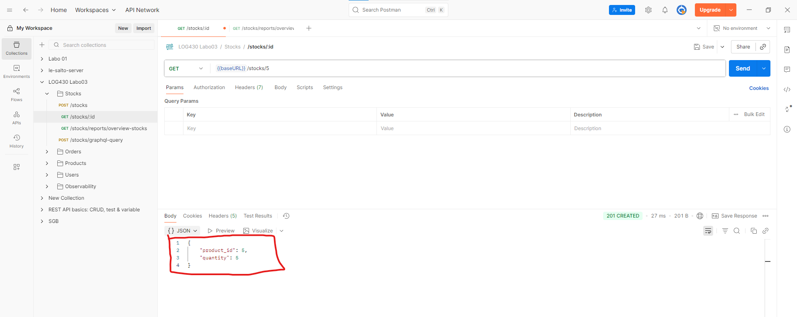
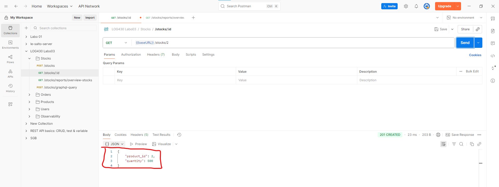
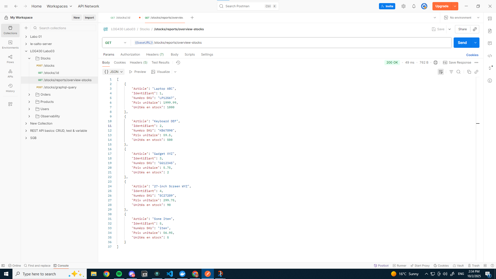

<div align="center">

<center>
<h1 style="font-size:18pt;">
Labo 03 – REST APIs, GraphQL
</h1>
</center>

<br>
<br>
<br>
<br>

<center>
<h2 style="font-size:16pt;">
PAR
</h2>
</center>

<br>
<br>

<center>
<h2 style="font-size:16pt;">
Marc CHARLEBOIS, CHAM65260301
</h2>
</center>

<br>
<br>
<br>
<br>
<br>
<br>

<center>
<h3 style="font-size:14pt;">
RAPPORT DE LABORATOIRE PRÉSENTÉ À MONSIEUR FABIO PETRILLO DANS LE CADRE DU COURS <em>ARCHITECTURE LOGICIELLE</em> (LOG430-01)
</h3>
</center>

<br>
<br>
<br>
<br>
<br>

<center>
<h3 style="font-size:14pt;">
MONTRÉAL, LE 3 OCTOBRE 2025
</h3>
</center>

<br>
<br>
<br>
<br>
<br>

<center>
<h3 style="font-size:14pt;">
ÉCOLE DE TECHNOLOGIE SUPÉRIEURE<br>
UNIVERSITÉ DU QUÉBEC
</h3>
</center>

<br>
<br>
<br>
<br>
<br>

</div>

---
## **Tables des matières**
- [**Tables des matières**](#tables-des-matières)
  - [**Question 1**](#question-1)
  - [**Question 2**](#question-2)
  - [**Question 3**](#question-3)
  - [**Question 4**](#question-4)
  - [**Question 5**](#question-5)
  - [\**Question 6*](#question-6)

<br>
<br>
<br>
<br>
<br>

---

<div align="justify">

### **Question 1**

> Quel nombre d'unités de stock pour votre article avez-vous obtenu à la fin du test ? Et pour l'article avec id=2 ? Veuillez inclure la sortie de votre Postman pour illustrer votre réponse.


À la suite du test du flux de stock, mon article nouvellement créé a bien vu son stock évoluer de façon cohérente. Après l’ajout initial de 5 unités, puis la création d’une commande de 2 unités, le stock est descendu à 3 unités. Lorsque j’ai supprimé cette commande (étape extra), le stock est revenu à 5 unités, ce qui confirme que le système met correctement à jour la base de données et reflète l’état attendu du stock en fonction des opérations effectuées.




Concernant l’article déjà présent dans la base avec l’id=2, celui-ci n’a pas été touché durant le scénario de test. Son stock est donc resté inchangé à 500 unités, tel qu’initialisé dans le script SQL fourni. Les résultats obtenus montrent ainsi que les opérations sur un produit donné n’affectent pas les stocks des autres articles de la base.




### **Question 2**

> Décrivez l'utilisation de la méthode join dans ce cas. Utilisez les méthodes telles que décrites à Simple Relationship Joins et Joins to a Target with an ON Clause dans la documentation SQLAlchemy pour ajouter les colonnes demandés dans cette activité. Veuillez inclure le code pour illustrer votre réponse.

La méthode join de SQLAlchemy est utilisée ici pour relier la table `stocks` à la table `products` grâce à la clé étrangère `Stock.product_id` et la clé primaire `Product.id`. Cette jointure permet de compléter les informations de stock (quantité) avec des données du produit (`name`, `sku`, `price`) issues de la table `products`, ce qui correspond à une clause `INNER JOIN` en SQL. Ainsi, chaque ligne renvoyée contient à la fois les informations d’inventaire et les détails du produit, comme le montre le code ci-dessous :

```Python
def get_stock_for_all_products():
    """Get stock quantity for all products"""
    session = get_sqlalchemy_session()

    results = (
        session.query(
            Stock.product_id,
            Product.name,
            Product.sku,
            Product.price,
            Stock.quantity
        )
        .join(Product, Stock.product_id == Product.id)
        .all()
    )

    stock_data = []
    for row in results:
        stock_data.append({
            'Identifiant': row.product_id,
            'Article': row.name,
            'Numéro SKU': row.sku,
            'Prix unitaire': float(row.price),
            'Unités en stock': int(row.quantity),
        })

    return stock_data
```




### **Question 3**

> Quels résultats avez-vous obtenus en utilisant l’endpoint POST /stocks/graphql avec la requête suggérée ? Veuillez joindre la sortie de votre requête dans Postman afin d’illustrer votre réponse.


### **Question 4**

> Quelles lignes avez-vous changez dans update_stock_redis? Veuillez joindre du code afin d’illustrer votre réponse.


### **Question 5**

> Quels résultats avez-vous obtenus en utilisant l’endpoint POST /stocks/graphql avec les améliorations ? Veuillez joindre la sortie de votre requête dans Postman afin d’illustrer votre réponse.


### **Question 6*

Examinez attentivement le fichier docker-compose.yml du répertoire scripts, ainsi que celui situé à la racine du projet. Qu’ont-ils en commun ? Par quel mécanisme ces conteneurs peuvent-ils communiquer entre eux ? Veuillez joindre du code YML afin d’illustrer votre réponse.